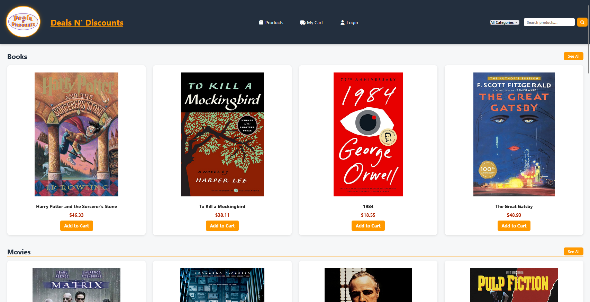
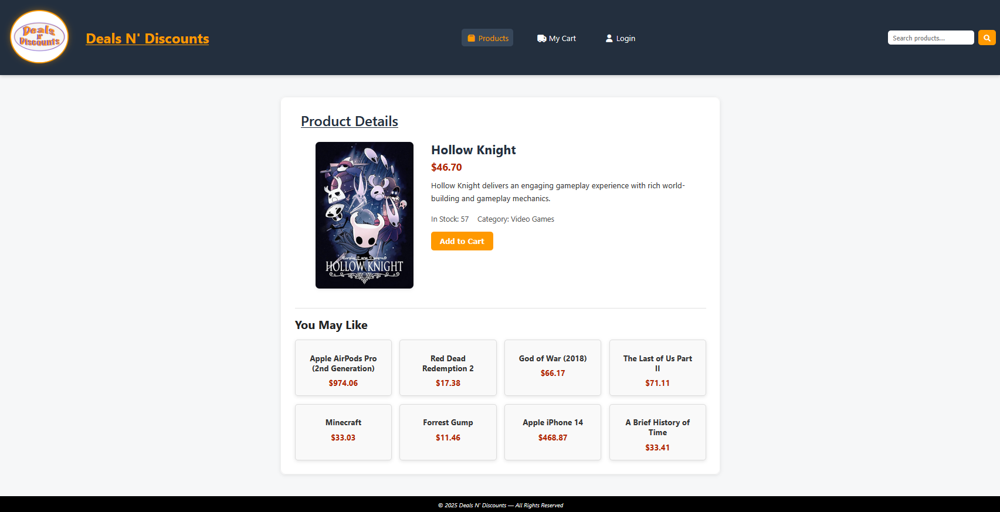
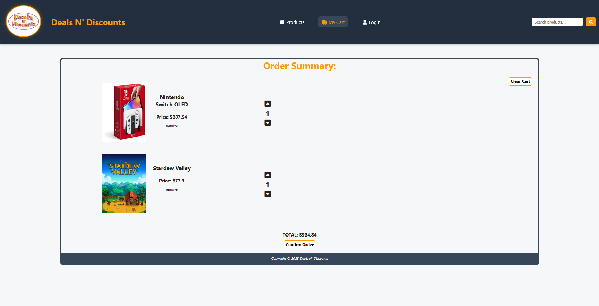
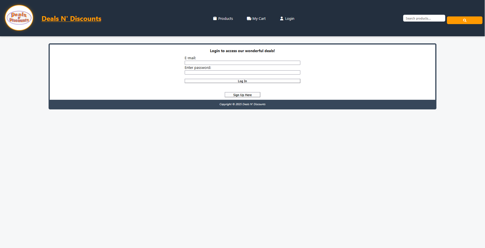

# Deals N' Discounts
This project was built to simulate a real-world e-commerce platform and demonstrate full-stack development skills in a production-style environment.

A full-stack e-commerce application built with Node.js, Express, and MongoDB, demonstrating real-world concepts such as authentication, REST APIs, database integration, and dynamic UI rendering.

Users can browse products, search by category, manage a shopping cart, create accounts, and place orders with persistent storage using MongoDB.

> Note: The README.md file that goes with the project is separetley titled README(project).txt which was included as part of the assignment, but also shows a way to run the project locally, along with original project team contributions.


## Live Demo

Try the live application here:  
**https://deals-n-discounts.onrender.com/**

> Note: This project is hosted on Render’s free tier, so the first load may take a few seconds while the server wakes up.

---

## Screenshots

### Home Page


### Product Page


### Cart Page


### Login Page



---

## Features

- Display products from a json file
- Display products by catergory
- Save items to a shopping cart
- Update product stock in a mongodb database
- Save orders to a mongodb database
- Register user accounts
- Authenticate users

---

## Key Technical Highlights

- Designed and implemented a full-stack architecture using Express to serve both frontend and API routes
- Built a RESTful API supporting authentication, products, and order management
- Integrated MongoDB Atlas with Mongoose for persistent, structured data storage
- Implemented JWT-based authentication with protected routes
- Developed a dynamic frontend using vanilla JavaScript and ES modules
- Created a centralized configuration system to eliminate hardcoded API and route values
- Managed client-side state using localStorage and sessionStorage

---

## Authentication

- Secure user registration and login
- JWT-based authentication
- Token stored in localStorage
- Protected routes (orders, dashboard, profile)

---

## Deployment

The application is deployed as a full-stack Node/Express web service on Render.

- Frontend is served from the Express server
- Backend API routes are hosted on the same Render service
- MongoDB Atlas is used for persistent product, user, and order data
- Environment variables are managed through Render

---

## Project Status

This project is deployed as a live portfolio application and is actively maintained. Future improvements may include additional UI polish, admin tools, advanced filtering, and further backend modularization.

---

## Tech Stack

### Frontend
- HTML5
- CSS3
- Vanilla JavaScript (ES Modules)

### Backend
- Node.js
- Express.js

### Database
- MongoDB Atlas
- Mongoose

### Other
- REST APIs
- LocalStorage (cart persistence)
- SessionStorage (checkout flow)

---

## Project Structure
```
├── css
│   ├── index.css
│   ├── login.css
│   ├── order.css
│   ├── products.css
│   └── styles.css
├── images
│   ├── screenshots
│   │   ├── cart.png
│   │   ├── home.png
│   │   ├── login.png
│   │   └── product.png
│   ├── logo.webp
│   ├── product1.jpg
│   ├── product2.jpg
│   ├── product3.jpg
│   ├── ...
│   ├── product98.jpg
│   ├── product99.jpg
│   └── product100.jpg
├── js
│   ├── home.js
│   ├── login.js
│   ├── order.js
│   └── products.js
├── views
│   └── login.ejs
├── app.js
├── index.html
├── LICENSE
├── login.html
├── model_order.js
├── model_product.js
├── model_user.js
├── oldcode.txt
├── order.html
├── package.json
├── products_real_titles.json
├── products.html
├── README.md
├── README(project).txt
├── script.js
├── Sources.txt
└── yarn.lock


```

---

## Running the project

You can view the live, production version of this application hosted on Render here: 
**[Live Demo Link](https://deals-n-discounts.onrender.com)**


To set up the project locally for development and testing, follow the steps below.

### Prerequisites
Make sure you have [Node.js](https://nodejs.org/) (v16+ recommended) and git installed on your machine.


### Local Setup Instructions

### 1. **Clone the Repository:**

   ```bash
   git clone [https://github.com/YOUR_GITHUB_USERNAME/YOUR_REPOSITORY_NAME.git](https://github.com/ian-swartz/Deals-N-Discounts.git)
   cd Deals-N-Discounts
   ```

### 2. **Install Dependencies:**

   Install the required Node.js middleware packages (including Express, Mongoose, Passport, and Dotenv):

    ```bash
    npm install
    ```

### 3. **Configure Environment Variables:**

   Create a file named ```.env``` in the root directory of the project and add your secure configuration credentials:

    ```bash
    PORT=5000
    MONGODB_URI=your_mongodb_atlas_connection_string
    SESSION_SECRET=your_local_session_encryption_secret
    ```
    > Note: The ```.env``` file is within the ```.gitignore``` in order to protect database credentials from the public.

### 4. **RUN the Application:**
   
   Start the Express server locally:

    ```bash
    npm start
    ```

### 5. **Access the Storefront:**
    
   Open your preferred web browser and navigate to:

    ```
    https://localhost:5000
    ```


---

## Key Improvements (Post-Migration)

- Migrated from CodeSandbox → GitHub
- Implemented MongoDB Atlas integration
  - Had to relink to database
  - Restructured so the connect string (secret) wasn't hard coded/visible 
- When users register they no longer have to relogin
- Fixed some styling, formatting, and bugs regarding linking to the database

---

## Author

Developed by: Ian Swartz 

GitHub: https://github.com/ian-swartz

---

Project Created for Millersville CMSC 421 - Web Application Development

Original CodeSandbox (Group) Share Link: **https://codesandbox.io/p/sandbox/serene-tamas-d6gnqp**

CodeSanbox (Group) Website Link: **https://d6gnqp.csb.app/**

CodeSandbox (Forked) Share Link: **https://codesandbox.io/p/sandbox/finalproject-forked-for-github-p6666c**

CodeSanbox (Forked) Website Link: **https://p6666c.csb.app/**

(CodeSandbox doesn't always load all the images, which I believe may be a server issue).

